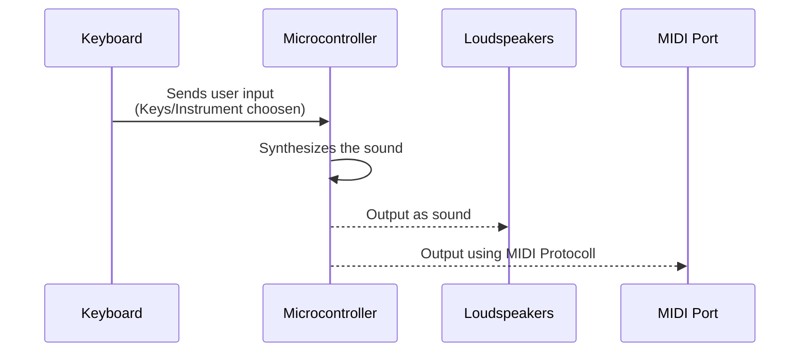
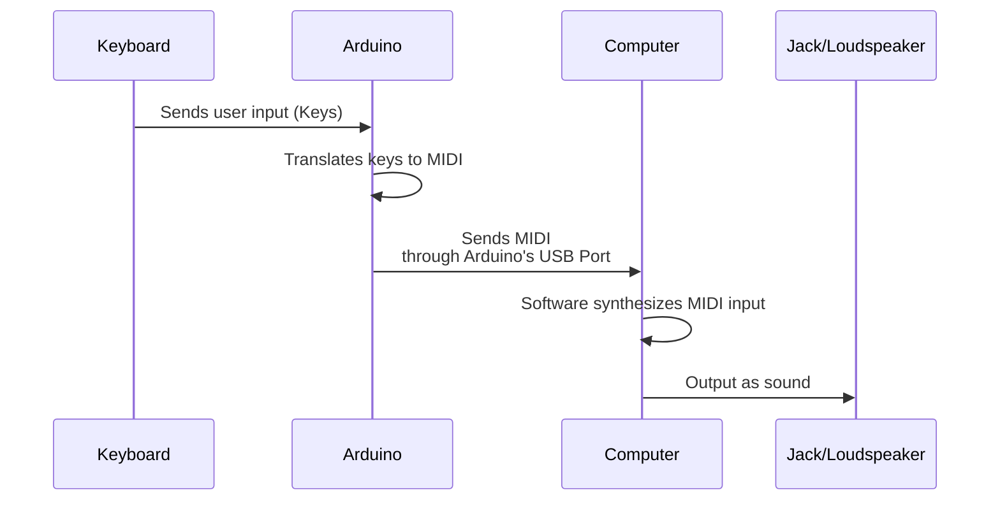
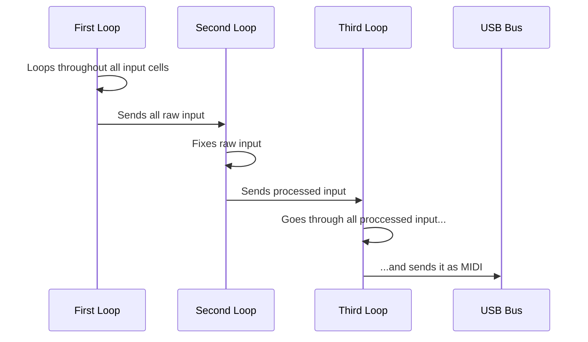

## Intro and Components 
In this project, I'll show you how to replace the internal circuit of a broken Keyboard  and used an Arduino UNO to rewire it and connect it to the PC. You'll need:

 - Keyboard
 - Arduino UNO (or Nano)
 -  A 10K Resistor
 - Shift Register 74HC595
 - Some LEDs (Optional)
 

## Motivation 
I found a keyboard on the streets that was going to go to the rubbish. I found it pretty cool and thought I could make use of it in some project. Or at least, I could just take it apart to get some circuits for myself :D <br>
On the Internet, I found some interesting projects (see Sources) which did their own DIY [MIDI Keyboard](https://en.wikipedia.org/wiki/MIDI_keyboard) using an Arduino. <br>
I decided to make my own version of it, as it was pretty close to what I'm studying in my degree (shift registers, address and data buses, C Programming, etc). <br>
This aims to be an overview of the problems I encountered and my implementations to solve it, but also a complete documentation in order to help more people build their own one if they're interested


## Technical Background 
### Functionality comparison
In a usual keyboard, the internal microcontroller processes and synthesizes. The user can also choose a sound output by the loudspeakers or MIDI output by MIDI port. The latter is mainly used to plug more music appliances, like a mixing board.



In my keyboard, the internal microcontroller is damaged, so I'm going to rewire the Keyboard to use our Arduino as a controller, it will act as a kind of translator between the keyboard and the PC.  *Arduino will read the keyboard input and send it as MIDI through its USB*, to then be processed by the PC to sound


This has some advantages:

 - We can now use PC's Jack Port (Great if you live in a shared apartment as I do)
 - We can import our own synthesizer sounds to the app of our choice
 - We can define custom behaviours for some keys (See Custom Fixes)
 - Keyboard's power outlet will no longer be necessary

### How does keyboard input work? (Keyboard Matrix)
My keyboard has 61 keys, but out of it comes a ribbon with only 17 cables. How is it possible? Click the following link to see a detailed explanation about it.
https://pcbheaven.com/wikipages/How_Key_Matrices_Works/

TLDR: To save money on cables and pins, music keyboards but also typing keyboards use a matrix, where each key is controlled by a combination of a column and a row. This way, the number of keys increases exponentially to the cables instead of linearly. Example: With 10 cables, we could power up to 25 (5²) Keys.

## Steps 
### Map each key to its row and column


Using a voltmeter with the electrical continuity setup, I pressed a key and tested with every combination if electricity flowed between them. If it does, the best you can do is put a sticker on the key with the two cables used, it'll help us later!
At first, it was difficult to relate which key related to each cable combination, but later I started to identify patrons and it became much easier


### Wiring Diagram
I made the wiring diagram based on the sources listed below, and I adapted it to my keyboard. I ran out of digital pins and used some analogue ones too. I could also have inverted the polarity, so instead of controlling the 6 row lines with the shift register and reading from the 11 column pins, 2 shift registers would control the 11 column lines and Arduino will read the input from the 6 row pins. But that would have needed a second shift register using it as a slave, which didn't have at my reach


### Flash MocoLUFA Firmware on your Arduino UNO
The Arduino UNO, unlike more expensive models of the ecosystem, isn't recognized as a USB device out of the box by the PC. <br>
There are two solutions for that, <br>

 - either to install a program that *turns the Arduino Serial Communications into MIDI input* of a virtual device
 or 
 - to flash a custom firmware to the Arduino UNO (called MocoLUFA) which will make the PC acknowledge it as a USB device and capable of sending MIDI input.

I chose the second option, because it meant more simplicity for the end-user, as it's plug-and-play.
When you flash a firmware, you always have the risk of bricking the device, but in my case it all went as a charm.

MocoLUFA Official Repo: https://github.com/kuwatay/mocolufa


### Upload the code
To upload the code to Arduino, you'll need to connect
The code, as the wiring, is "deeply inspired" from other enthusiasts. Still, I made some performance improvements (deleted unnecessary loop and some redundant functions) and made it even simpler. <br>
You can access my code in the repo files, the basic version and also the version that fixes the problems of the next chapter

It works!

https://github.com/Turdetano/arduino-midi-usb-keyboard/assets/113845085/59fc0676-3079-492f-b0e9-bdee59b5e558


## Custom Fixes 
When I started playing, I found out that something was wrong with the keys...<br>


https://github.com/Turdetano/arduino-midi-usb-keyboard/assets/113845085/ac5e1b9f-aa3d-494b-8c6c-6d5e40090557


### Contact Fault
In 2 keys, I had the problem that when pressed, it would go on and off. That meant that the keyboard, instead of sending the note one time, it sent it multiple times, and made it sound horrible.
I fixed it with this with a matrix, where I would log for how many cycles was the key pressed in a row. These special keys would only go off after the threshold. If a press was detected or the threshold was reached, the countdown resets itself.

#### Code functionality

```
uint8_t  keyPressed[NUM_ROWS][NUM_COLS];

//Here I declare the keys that do not work correctly
keyLogMap[3][1]=1;
keyLogMap[3][2]=1;
keyLogMap[3][3]=1;
keyLogMap[3][4]=1;
```
[Omitted Code]
```
else  if  (rowValue[rowCtr] != 0 && keyPressed[rowCtr][colCtr] && keyLogMap[rowCtr][colCtr])  {
	keyLogMap[rowCtr][colCtr] = 1;//This resets release countdown if active
	}
else  if  (rowValue[rowCtr] == 0 && keyPressed[rowCtr][colCtr])  {
	if  (keyLogMap[rowCtr][colCtr])  { // check if key should be logged, keys with 0 will skip this
		if  (keyLogMap[rowCtr][colCtr] > RELEASE_DELAY)  {
			keyLogMap[rowCtr][colCtr] = 1; 
			keyPressed[rowCtr][colCtr] = false;
			MIDI.sendNoteOff(keyToMidiMap[rowCtr][colCtr], NOTE_OFF_VELOCITY, 1);
		}  else{
		keyLogMap[rowCtr][colCtr]++;
		}
	}  else  {
	keyPressed[rowCtr][colCtr] = false;
	}
}
```
This is how it sounds with this fix, but there is another problem that I'll address in the next chapter...


https://github.com/Turdetano/arduino-midi-usb-keyboard/assets/113845085/19746de3-efc1-4070-abcf-0eee19fe7710


### Pressing a key also activates others
As you can see in the previous videos, the keyboard's hardware is faulty, and sometimes when a key is pressed, it generates ghost inputs in adjacent keys. <br>
My software-side solution would be to declare these exceptions, go through all inputs received, process it to remove the unwanted keys and then play the desired ones.
<br>This diagram is the solution I came up with:


In our C Programming Courses, whose functionality  would be a good idea to use them. If I use variables instead, they would need to be manually updated, but with a pointer I just need to refer to the variable I'm interested in.<br>

#### My Code Implementation


       int* wrongActivation[NUM_WA_ROWS][NUM_WA_COLUMNS] = {
      { &keyPressed[3][4], &keyPressed[3][5], &keyPressed[3][0] },
      { &keyPressed[3][3], &keyPressed[3][4], &keyPressed[3][0] },
      { &keyPressed[3][2], &keyPressed[3][4], &keyPressed[3][0] },
      { &keyPressed[3][5], &keyPressed[3][0], &dontCare },
      { &keyPressed[3][1], &keyPressed[3][2], &dontCare },
      { &keyPressed[3][0], &keyPressed[3][1], &dontCare },
    };
    
> The exceptions are declared. If keys 3-4, 3-5 and 3-0 are pressed at the
> same time, only 3-4 will sound.

[Omited First Loop (Input is read)]

    for (fixIndex = 0; fixIndex < NUM_WA_ROWS; fixIndex++) {
        if (*wrongActivation[fixIndex][0] != 0) {
          int allPressed = 1;
          for (fixArg = 1; fixArg < NUM_WA_COLUMNS; fixArg++) {  //starts on the 2nd element of wrongActivation array
            if (*wrongActivation[fixIndex][fixArg] == 0) {       //It cancels it if conditions not fullfilled
              allPressed = 0;
              break;
            } else if (*wrongActivation[fixIndex][fixArg] == 3) {  // Reaches blank spaces and breaks loop
              break;
            }
          }
          if (allPressed) {
            while (fixArg > 0) {  //Set rest to false
              *wrongActivation[fixIndex][fixArg] = 0;
              fixArg--;
            }
          }
        }
      }
  

> Code realization of the suggested behavior

Unfortunately, this fix doesn't seem to work. It seems to happen because the fault keys don't seem to be pressed just at the same time, so it sounds strident at the start. It could be fixed adding more delays, but it'd make it even less "responsive". 

## Final Remarks
I'm happy to have done this project, I learnt a lot and I had lots fun in the process even though I couldn't finish it the way I liked.<br>
In the end, I bought a second hand piano and I've been practicing with it ever since. Who knows, maybe I am the next Ray Charles :)


## Sources and honorable mentions

 - Code inspired from:
	 - https://github.com/evankale/ArduinoMidiPiano/
	 - https://github.com/hanomaly/old-keyboard-to-midi-controller
- Kudos to this great Spanish-speaking Channel about Arduino&Music: https://www.youtube.com/@robotekmania
 - Circuit designed with: https://www.kicad.org
 - Great FOSS-App to start playing piano: https://www.pianobooster.org/

